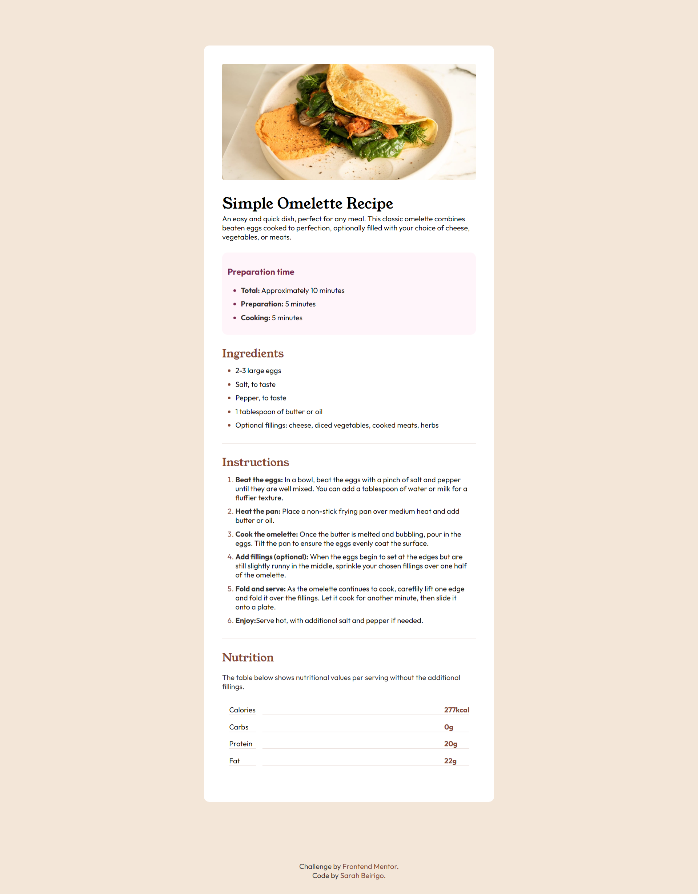

<p align="center"></p>


<h2 align = "center"> 🏆 Frontend Mentor - Solução do desafio Recipe Page</h2>

Esta é uma solução para o desafio [Recipe Page no Frontend Mentor](https://www.frontendmentor.io/challenges/recipe-page-KiTsR8QQKm/hub). Os desafios do Frontend Mentor ajudam a aprimorar as habilidades de codificação, recriando projetos do mundo real.


🍽️ **Projeto de Página de Receita** é um projeto simples e responsivo de página de receitas desenvolvido utilizando HTML e CSS. O foco é exibir receitas de forma organizada e visualmente atraente, destacando o layout limpo e as boas práticas de design front-end.

 <!-- Substitua pela URL correta da imagem de pré-visualização -->

## 📋 Descrição do Projeto

O projeto **Recipe Page** visa fornecer uma página acessível para exibir uma ou mais receitas culinárias, com a lista de ingredientes, passos para o preparo e imagens ilustrativas. Todo o layout foi desenvolvido utilizando HTML semântico e estilizado com CSS, sem o uso de bibliotecas ou frameworks adicionais.

## 🔧 Tecnologias Utilizadas

- **HTML5** - Para a estruturação do conteúdo
- **CSS3** - Para a estilização e responsividade
- **FLEXBOX** - Para organizar e alinhar os elementos na página

## 🚀 Funcionalidades

- Layout responsivo e otimizado para diferentes dispositivos
- Exibição de uma receita com título, ingredientes e modo de preparo
- Imagens ilustrativas para acompanhar a receita


### Links

- [URL DESAFIO](https://www.frontendmentor.io/challenges/recipe-page-KiTsR8QQKm/hub)
- [MINHA SOLUÇÃO]([https://sua-url-do-site-ao-vivo.com](https://recipe-page-mu-two.vercel.app/))


### ✍️ Aprendizado

Durante o desenvolvimento deste projeto, refinei meu conhecimento em:

- Utilização de **HTML5 semântico** para garantir a acessibilidade e boas práticas de SEO.
- Desenvolvimento de **layouts responsivos** utilizando **Flexbox**.
- Modularização de estilos em CSS para garantir manutenibilidade e clareza no código.


## 📂 Estrutura de Pastas

```bash
recipe-page/
│
├── assets/                # Pasta de ativos
│   ├── css/               # Pasta de estilos
│   │   └── style.css      # Arquivo principal de estilos
│   ├── images/            # Pasta de imagens (previews e ilustrações)
│   └── media-queries.css  # Arquivo de media queries
│
├── index.html             # Página inicial
└── README.md              # Documentação do projeto

```

## 🖥️ Como Rodar o Projeto Localmente

1. Clone o repositório:

```bash
git clone https://github.com/sarahbeirigo/recipe-page.git
```

2. Navegue até o diretório do projeto:

```bash
cd recipe-page
```

3. Abra o arquivo `index.html` diretamente no navegador para visualizar a página de receitas.

## 📝 Contato

Se você quiser saber mais sobre o projeto ou entrar em contato:

<a href = "mailto:sarahcbeirigo@gmail.com"></a>
<a href="https://www.linkedin.com/in/sarah-beirigo/" target="_blank"></a>
##
<p align="center">👩🏼‍💻 Coded by <a href="https://github.com/sarahbeirigo">Sarah Beirigo</a></p>

